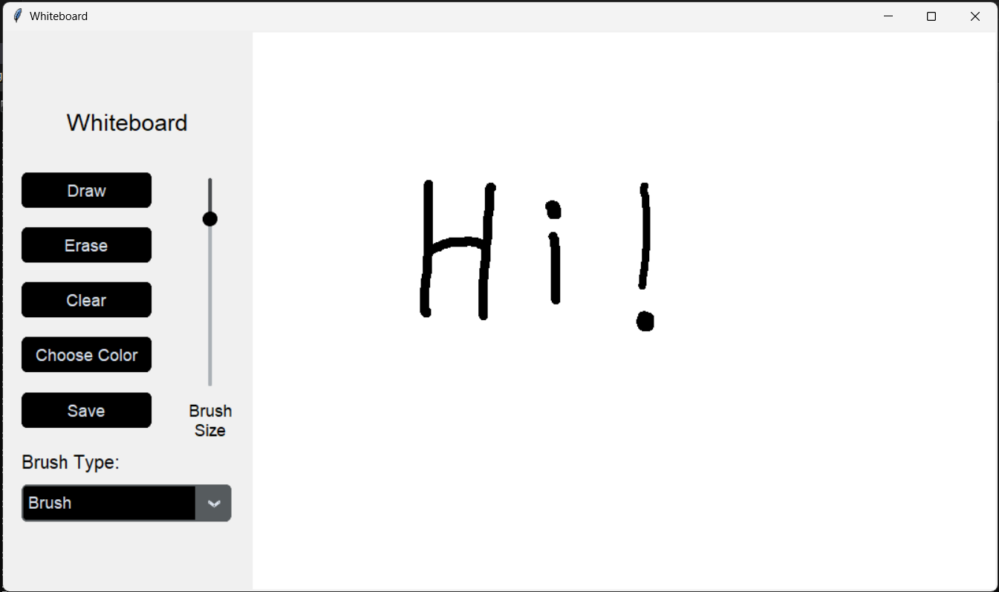
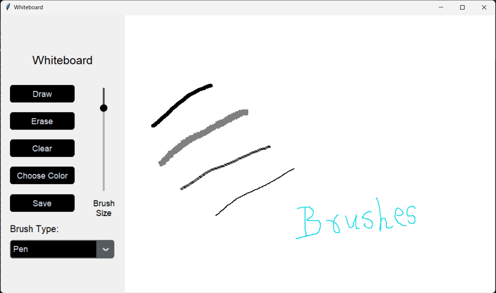
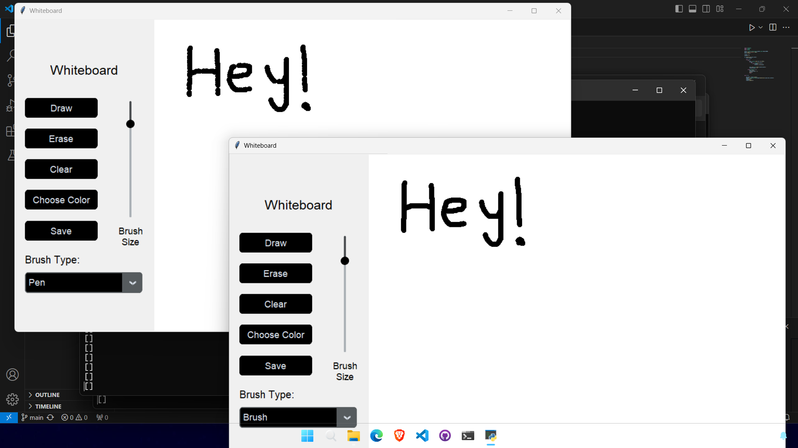

# Collaborative Whiteboard
Winning project of the **Rapid Codeathon** event part of **TechnoVIT'24**, was done in around ~ 3 hours. w/ [Mehtab](https://github.com/Meht4b) & [Kapil](https://github.com/Turbo0007).

Enables basic whiteboard collaboration with different clients with many other features like, brush size, multiple brush types, color selection, saving etc.

### Whiteboard

### Brush Types

### Collaboration
